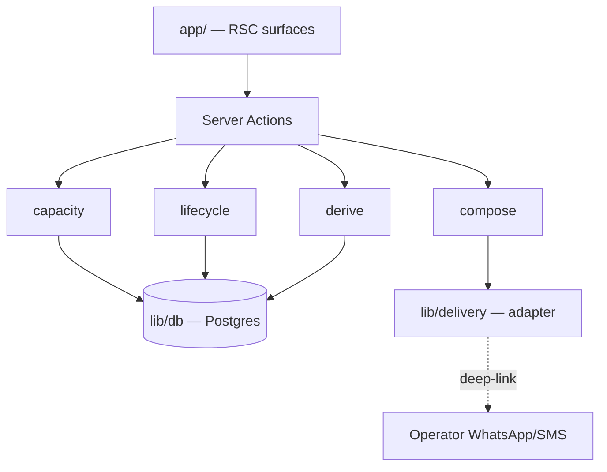
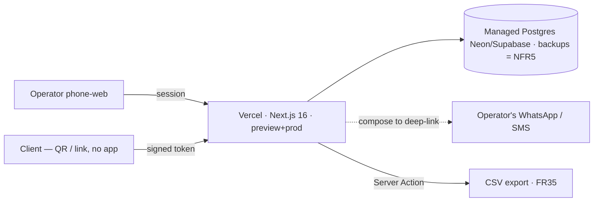
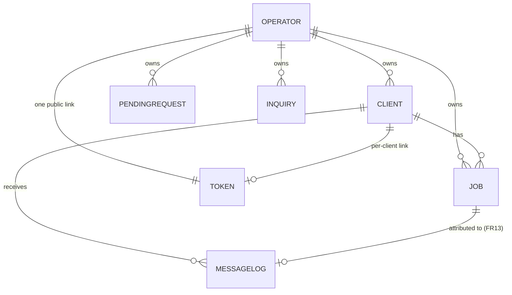

# Architecture Spine — LovesCleaning

## Design Paradigm

**Server-first full-stack.** React Server Components render every surface; **Server Actions** are the only mutation entry point; **Postgres is the single source of truth.** There is no separate API tier and no client-side data store. Client Components exist only for interactivity that cannot be server-rendered, and they reach data solely by invoking Server Actions.

Layers map to directories:

| Layer | Directory | Role |
| --- | --- | --- |
| Surfaces | `app/` | RSC pages + route handlers (operator dashboard, client booking views) |
| Mutations | `app/**/actions.ts` | Server Actions — the sole write path |
| Domain | `lib/domain/` | `capacity`, `lifecycle`, `derive`, `compose` — pure logic, no framework imports |
| Delivery | `lib/delivery/` | Channel adapters (v1: deep-link) |
| Data | `lib/db/` | Drizzle schema + queries; the only module that speaks SQL |

## Invariants & Rules



*Dependency direction: surfaces → actions → domain → db. Nothing lower may import a layer above it; nothing bypasses actions to reach db from a surface.*

### AD-1 — Server-first write path `[ADOPTED]`

- **Binds:** all; NFR1
- **Prevents:** units inventing REST endpoints, client caches, or direct DB reads from Client Components that fork the write path.
- **Rule:** Every mutation is a Server Action. No separate API tier; no client-side data store. Only `lib/db/` issues SQL; surfaces never import it directly.

### AD-2 — Capacity has exactly one owner

- **Binds:** FR1, FR2, FR7, FR9, FR26, FR27, FR36, FR39, FR41; NFR4
- **Prevents:** two independent cap-checkers racing on the last slot → double-book; capacity and dashboard disagreeing about the same day.
- **Rule:** A single `capacity.commitBooking()` is the **only** code that inserts a capacity-consuming Job. It re-checks the per-day cap and the weekly-14 ceiling inside one transaction and commits-or-rejects. Which Job states consume capacity is defined once as `capacity.consumesSlot(job)`: `booked`, `completed`, and `no-show` consume (a no-show held the operator's time, FR40); `cancelled` does not (FR41). **Both** `commitBooking` and `derive.roomLeft` call this one predicate. A row in `jobs` **always** represents consumed capacity per `consumesSlot`; capacity is never inferred from any other table. All three slot-consuming paths — client-confirm (FR7), operator approve-from-queue (FR36), operator direct (FR39) — call `commitBooking`. The FR39 cap **override** is a boolean argument into it, never a separate insert path.

### AD-3 — Exactly-one-winner concurrency

- **Binds:** FR2, FR9, FR36; NFR4
- **Prevents:** concurrent public bookings on the last open slot both succeeding.
- **Rule:** `commitBooking` serializes concurrent claims via `SELECT … FOR UPDATE` on the day row (preferred) or `pg_advisory_xact_lock()` — a **transaction-scoped** lock — **inside one `db.transaction()`**, with both caps re-evaluated inside the lock. Session-scoped `pg_advisory_lock()` is **forbidden**: Vercel serverless uses transaction-mode connection pooling (Neon/Supabase pgBouncer), under which session-scoped locks silently break mutual exclusion. Exactly one claim wins the last slot; the rest receive no-availability.

### AD-4 — Approval queue holds no capacity

- **Binds:** FR6, FR7, FR36
- **Prevents:** stranger-held phantom reservations; approving a pending request into an already-full slot; a queue row silently consuming capacity.
- **Rule:** A pending new-client request is **not a Job** — it is a distinct `PendingRequest` row that neither reserves nor consumes capacity (a Job exists only for confirmed bookings and always consumes, AD-2). Capacity is consumed only when approval calls `commitBooking`, creating the Job under the cap re-check. When several pending requests target one slot, the **first approval wins** and the rest are surfaced as no-longer-available. Known clients on a per-client link (FR7) skip the queue and commit directly.

### AD-5 — Compose ≠ deliver

- **Binds:** FR11, FR13, FR18, FR19, FR20, FR21, FR31
- **Prevents:** transport details leaking into templates; a future auto-send transport forcing a template rewrite; one tap logging two dispatches; phantom dispatches on unsent drafts.
- **Rule:** `compose` turns `(client, slot, amount, template)` into a channel-agnostic `MessageDraft{ recipient, body, type }`. A `lib/delivery` **adapter** renders the draft to a `wa.me` / `sms:` deep-link in v1. Templates depend only on `MessageDraft`, never on the transport. Auto-send later = a new adapter, no template change. Dispatch is recorded **once, only on the operator's explicit send tap** (idempotent per draft — a re-tap does not double-log), never on render. `MessageLog` distinguishes `drafted_at` from `dispatched_at`; only `dispatched_at` feeds the nudge-fatigue counter (§2).

### AD-6 — Token is capability

- **Binds:** FR3, FR4, FR5, FR7, FR33, FR34; NFR6
- **Prevents:** a per-client link acting as a public link (or the reverse); guessable client access; client accounts.
- **Rule:** The operator is a single authenticated session (FR33). Client links are **signed, unguessable tokens** (NFR6): a per-client token is scoped to one client; exactly one public token exists; the QR encodes the public token's URL (FR5). No client login (FR34). A bearer can do exactly what its token scopes — nothing more.

### AD-7 — Derived state is computed on read `[ADOPTED]`

- **Binds:** FR16, FR17, FR22, FR23, FR24, FR26, FR27, FR30; §2 counter-metrics; metric defs (addendum F); NFR7
- **Prevents:** two modules computing gone-cold, room-left, repeat-rate, or the counter-metrics differently; stored-flag drift.
- **Rule:** A single `derive` module computes `expectedNextDate`, `goneCold`, `roomLeft` (via `consumesSlot`, AD-2), `dayMaxed`, all dashboard metrics, **and the §2 counter-metrics** — overbooking rate (from `Job.overridden`) and nudge-fatigue (from `MessageLog.dispatched_at`) — from canonical rows on every render. The repeat-booking rate reads `Job.createdAt` and `Job.completedAt` per addendum F (rolling 30-day, same-client follow-on within 30 days of completion), never the scheduled `date` as a substitute. No stored derived flags, no cron, no background job. `goneCold` is a view-time computation surfaced when the operator opens the dashboard.

### AD-8 — Tenancy seam present, not built `[ADOPTED]`

- **Binds:** all persisted rows; FR33; Vision (multi-cleaner)
- **Prevents:** a schema rewrite + backfill — and a cross-tenant data leak — when multi-cleaner arrives.
- **Rule:** Every Client, Job, PendingRequest, Inquiry, MessageLog, and token row carries an `owner_id` FK. The `owner_id` **filter is present in every query from v1** (value hardcoded to the single operator), not merely the column — so the future split adds a value source, never a query retrofit. **No** tenant-scoping UI and **no** multi-user auth in v1.

### AD-9 — One clock for schedule math

- **Binds:** FR1, FR16, FR17, FR26; NFR4
- **Prevents:** cap and cadence arithmetic drifting between UTC and local time.
- **Rule:** Timestamps are stored in UTC; **all** capacity, cadence, and week arithmetic is computed in the operator's single local timezone. The weekly-14 boundary is **Monday–Sunday, operator-local** (FR1).

### AD-10 — Job lifecycle authority

- **Binds:** FR8, FR29, FR30, FR31, FR32, FR40, FR41
- **Prevents:** two modules disagreeing on legal Job transitions; a "paid no-show"; a resurrected terminal state; the ledger mutating completion.
- **Rule:** A Job's `completion` follows one state machine owned by `lib/domain/lifecycle`: `booked → completed | no-show | cancelled`; a `completed` Job may be corrected to `cancelled` but nothing transitions *out* of `no-show`/`cancelled` except an explicit operator correction. `payment` is orthogonal but gated: only a `completed` Job is ledger-eligible (`owed`/`paid`); `markPaid` sets `payment` and **never** alters `completion`. No path outside `lifecycle` writes `completion`; no path outside the ledger writes `payment`.

### AD-11 — Inquiry provenance and idempotency

- **Binds:** FR37, FR24; addendum F (conversion metric)
- **Prevents:** double-counting inquiries against the inquiry→booking metric; two writers racing on one link visit.
- **Rule:** Every Inquiry carries `source` provenance (`phone|walk-in|link|referral|other`). A link visit that begins a booking auto-logs **at most one** `link` Inquiry per token-visit session, written server-side; phone/walk-in/referral inquiries are operator-written. The conversion denominator (FR24) dedupes to distinct inquiries so an auto-log plus a manual log for the same contact is not counted twice.

### AD-12 — Booking idempotency and atomic reschedule

- **Binds:** FR7, FR36, FR41; NFR4
- **Prevents:** a client double-tap creating two Jobs; a reschedule that loses the booking or transiently over-caps.
- **Rule:** `commitBooking` is idempotent per booking attempt (an idempotency key per token-submit); a repeat submit returns the same Job, never a second. Reschedule (FR41) releases the original slot and commits the new one **inside one transaction** (under AD-2/AD-3), so capacity is never transiently double-held or lost.

### AD-13 — Latency budget bounds the paradigm

- **Binds:** NFR2, NFR3; AD-7
- **Prevents:** the RSC server-round-trip paradigm silently blowing the 4G budget; derive-on-read growing unbounded.
- **Rule:** Booking and dashboard surfaces target **<2s interactive on 4G** (NFR3) and a **<60s** client booking flow (NFR2). Derive-on-read (AD-7) stays within budget by keeping per-render queries indexed and scoped to one owner's rows (solo scale: hundreds of jobs); surfaces stay dynamic (no stale cache) and ship minimal client JS. If row volume ever breaks the budget, revisit materialization (Deferred) — not the paradigm.

## Consistency Conventions

| Concern | Convention |
| --- | --- |
| Naming | Entities singular PascalCase (`Client`, `Job`, `PendingRequest`, `Inquiry`, `MessageLog`); Server Actions verb-first (`commitBooking`, `logInquiry`, `markPaid`, `markOutcome`); domain modules lowercase (`capacity`, `lifecycle`, `derive`, `compose`). |
| Ids | Surrogate `uuid` PKs; every row carries `owner_id` (AD-8); tokens are signed, unguessable strings. |
| Dates & money | Timestamps stored UTC ISO-8601; schedule math in operator-local tz (AD-9). Money as integer cents, USD; the default job price is operator-**config**, not a hardcoded constant. |
| Cadence / status | `cadence: weekly\|biweekly\|monthly\|one-time`; `Client.status: active\|provisional\|gone-cold` (gone-cold derived, AD-7); `Job.completion: booked\|completed\|no-show\|cancelled` (transitions per AD-10); `Job.payment: paid\|owed`. |
| Mutation | Sole write path = Server Actions (AD-1); capacity-consuming writes only via `capacity.commitBooking` (AD-2); `completion`/`payment` only via `lifecycle`/ledger (AD-10). |
| Errors & observability | Server Actions return a typed `{ ok, data } \| { ok:false, reason }`; no thrown errors cross the action boundary, no silent catches. Capacity rejections carry a machine reason (`day-maxed` \| `week-full`). Errors land in Vercel platform logs; no separate APM/observability stack in v1 (deferred). |
| Simplicity gate | Scope-creep is a defect (NFR7 / FR25): no structure, column, or surface ships unless it serves a named leak or a capacity/cash decision. |
| Auth | Operator = session; clients = token bearer (AD-6). |
| Messaging | All outbound client comms are draft + tap-to-send (FR19); no autonomous send in v1. |

## Stack

*Seed — web-verified current at 2026-07-15; the code owns this once it exists.*

| Name | Version |
| --- | --- |
| TypeScript | 5.x |
| Next.js (App Router, Server Actions, RSC; Turbopack default) | 16.x (≥16.0.11) |
| React | 19.x (≥19.2.4) |
| Node | 20+ |
| Postgres (Neon or Supabase, managed; transaction-mode pooling) | 16+ |
| Drizzle ORM | latest |
| Vercel (host, preview + prod) | — |

*Operator auth middleware lives in `proxy.ts` (Next 16 renamed `middleware.ts`). Derive-on-read surfaces stay dynamic — never wrapped in `use cache` (AD-7/AD-13).*

## Structural Seed

**Deployment & environments (operational envelope):**



*No self-hosted infra. Managed-Postgres backups satisfy durability (NFR5). Secrets via Vercel env. Export (FR35) is a Server Action streaming the owner's rows as CSV. A one-row **Operator seed** migration establishes the `owner_id` every row references (AD-8).*

**Core entities:**



*Attribute detail lives in `lib/db` schema; only invariant-bearing attributes surface as ADs/Conventions. Key fields the metrics depend on: `Job.created_at`, `Job.completed_at`, `Job.overridden`; `MessageLog.drafted_at`, `dispatched_at`, optional `resulting_job_ref` (FR13).*

**Source tree:**

```text
app/
  (operator)/        # authenticated dashboard, ledger, approval queue, scheduling
  book/[token]/      # client booking surface (per-client + public), no login
  **/actions.ts      # Server Actions — sole write path (AD-1)
lib/
  domain/
    capacity.ts      # commitBooking + consumesSlot — sole capacity owner (AD-2/3/4/12)
    lifecycle.ts     # Job state machine — sole completion writer (AD-10)
    derive.ts        # gone-cold, room-left, metrics, counter-metrics on read (AD-7)
    compose.ts       # -> MessageDraft (AD-5)
  delivery/
    deeplink.ts      # v1 adapter: MessageDraft -> wa.me/sms: (AD-5)
  db/                # Drizzle schema + queries — only SQL speaker (AD-1)
```

## Capability → Architecture Map

| Capability / Area | Lives in | Governed by |
| --- | --- | --- |
| Availability + caps (FR1–2, FR9, FR26–28) | `lib/domain/capacity` | AD-2, AD-3, AD-9 |
| Booking links, QR, public/per-client (FR3–8) | `app/book/[token]`, `lib/db` tokens | AD-6, AD-12 |
| Approval queue + inquiry log (FR36–37) | `app/(operator)`, `capacity`, PendingRequest | AD-4, AD-11 |
| Rebooking + nudges (FR10–13) | `compose`, `app/(operator)` actions | AD-5, AD-7 |
| Client records + lapse (FR14–18) | `lib/db`, `derive` | AD-7, AD-8 |
| Messaging + templates (FR19–21) | `compose`, `lib/delivery` | AD-5 |
| Dashboard / leak detector + counter-metrics (FR22–25, §2) | `app/(operator)`, `derive` | AD-7 |
| Cash ledger (FR29–32) | ledger actions, `lib/db`, `derive` | AD-7, AD-10 |
| Job lifecycle: complete/no-show/cancel/reschedule (FR40–41) | `lib/domain/lifecycle` | AD-10, AD-12 |
| Operator auth, export (FR33–35) | session, export action | AD-6, AD-1 |
| Operator-initiated client + direct booking (FR38–39) | `app/(operator)` actions, `capacity` | AD-1, AD-2 |

## Deferred

- **Autonomous message sending** (WhatsApp Business / Twilio) — v1 is draft + tap-to-send (FR19); AD-5 keeps the adapter seam so this slots in later without template rework.
- **Card processing / auto-charge** — rejected for v1 (cash + ledger + reminder). No payment-processor surface in scope.
- **Multi-cleaner tenancy logic, geographic routing, team forecasting** (Vision) — the `owner_id` column + filter is present now (AD-8); scoping UI and multi-user auth deferred.
- **Time-slot (clock-time) scheduling** — v1 uses per-day caps; revisit only if clients demand specific times.
- **Native mobile app** — out; phone-web + operator's WhatsApp/SMS covers both sides.
- **Materialized metrics / background jobs** — deferred behind AD-7/AD-13; revisit only if read-time derivation breaks the latency budget at scale.
- **Observability / APM stack** — v1 uses Vercel platform logs + typed action results only.
- **Open PRD questions** — CSV-export sufficiency for data-ownership (OQ-4); capacity defaults Mon–Sat / 3-per-day (OQ-1). Defaults assumed, operator-editable.
